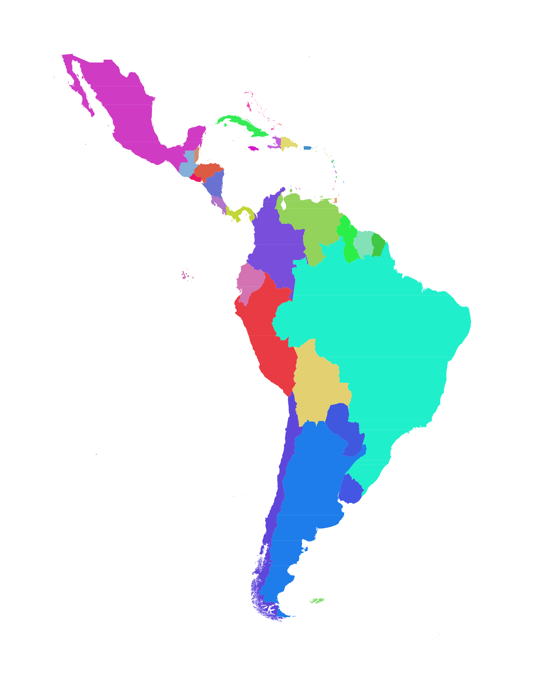

# Américas Gauntlet TPG

These are the rules for the Américas Gauntlet TPG.

Join [CGCord](https://discord.gg/chicagogeographer) and [visit the thread][thread] to play.

## tl;dr for experienced players

This is a TPG gauntlet-style spinoff. Rules are generally quite similar (and, in fact, mostly cribbed directly from) the [TPG Gauntlet Rules](https://docs.google.com/document/d/1gK93eqVsWQuRqLSuRe3txIaCYo2pcrjkylm6AiKFO5I/edit?tab=t.0), so if you are familiar with that, you mostly know how to play.

The most important difference is that, in this game, all target locations will be randomly drawn on land in “the Américas”: south of the continental United States, north of the [Antarctic Convergence](https://en.wikipedia.org/wiki/Antarctic_Convergence), and between 30°W and 120°W longitude. Here's a map:

You may submit (subject to the other rules) any photo you've taken anywhere on earth, even outside of these locations, if you find that it would be to your advantage to do so.

Other minor rule differences:

* In the case of a tie, all players whose submission is less than 25 meters further from the computed-last-place player will be eliminated; there is no tiebreaker provision.
* All rounds will be drawn on land uniformly within the allowed area; for this season, there are no water rounds, urban rounds, or other special cases.
* There is no antipode rule; submissions 20,000&#8239;km away from the target will be scored as 20,000&#8239;km away from the target.
* You may use commas in your submitted coordinates, if that would somehow improve your life.

## Full rules

### Basic Info to Start Playing

**YOUR GOAL**: share the closest picture you’ve taken to a random location in the Américas.  
**WHERE**: Locations are posted every day in [the thread][thread], in the server linked above.  
**HOW**: In the thread, send your picture AND the exact coordinates where it was taken.

In this spinoff, there are no points. Instead, the furthest submitter will be eliminated, in addition to any non-submitters.

### Submission Rules

* Pictures must be your own OR taken when you were present.
* Pictures must be verifiably located at the coordinates you provide.
  * This isn’t as strict as it sounds- most pictures can be verified. An UNverifiable example is a picture of a generic tile floor. Essentially, a pic is verifiable if I can see that it matches on Street View, satellite imagery, online reviews, etc. Just be logical when submitting.
  * If you’re ever unsure if a picture can be verified, just ask the community for help in the \#tpg-discussion channel\!
  * Location data tagged to pictures DOES NOT count as verification, since this can be easily spoofed.
* Pictures taken from airplanes, etc., during flight DO NOT count. If you were on the ground, it’s eligible.
* When reusing a previously submitted picture for a new round, forward it along with the coordinates.
* To change submissions mid-round, please delete your original submission and send the new one, while mentioning that it’s a replacement.
* Coordinates must be pinpointable to a decent degree of accuracy. Most submissions should use 4-5 decimal points. 3 is highly frowned upon, other than in extreme circumstances. Less than 3 will not be accepted.

The submission of stolen pictures constitutes cheating, and violators will be banned.

## Game FAQ

* *Is it too late to start playing?*

    Unfortunately, players cannot be accepted after the first round has finished.

* *What happens if there are any nonsubmitters?*

    All non-submitters are eliminated automatically. Non-submitters will have their pictures looked over to see if they would have beaten last place, had they submitted. Only photos posted in the Chicago Geographer Discord server to a TPG or TPG spinoff are valid for use here. Pictures posted in \#pics-irl-travel or other channels are not valid. A user’s travel-map-collab regions are irrelevant. If all non-submitters would have beaten the last place submitter, then the non-submitter(s) and the last place submitter(s) are eliminated; if it cannot be proven they would have won, only the non-submitter(s) are eliminated and the last place submitter is spared.

* *Will there be water rounds?*

    No.

* *Are there ties?*

    Yes. All players within 25 meters of the furthest submission are considered tied for last. In the event of a tie for last, all tied players will be eliminated. Ties for any position except last will not be considered, as placement is not relevant outside of elimination positions.

* Can I target an antipode?

    Sure, but you will certainly lose; there is no bonus or grace for such submissions.

* *What happens if I’m on a flight / in the wilderness / somewhere without connection and have to miss a round?*

    Non-submission will always result in elimination UNLESS you let me know beforehand. If you let me know in advance, I can apply a non-losing picture for you (from one submitted in \#tpg-submissions or another tpg spinoff channel) if one exists. I’ll do this up to three times per player per season. Missing multiple rounds in a row is fine, as long as you let me know prior. If you have special circumstances and need more than three rounds total, please talk to me and we can try to work something out.

* *How are round locations chosen?*

    Random.org’s [decimal fractions API](https://www.random.org/decimal-fractions/) is used to pick two random numbers. These numbers will then be scaled appopriately to choose a location in the bounding box of “the Américas” as described above, and [GADM](https://gadm.org/) data will be used to reject picks not on land, in the US, or south of the Antarctic Convergence. For details, see [`create-round.ts`](src/create-round.ts). 
    
    Coordinate selection is independent from one round to the next; there are no country-exclusion rules, special water rounds, or other deviations from randomness.

* *How do I get the coordinates of my picture?*

    You can right-click any place on Google Maps, and the first menu option will copy the coordinates. Alternatively, many smartphone and smart camera pictures will have location data tagged internally, which is often accurate enough, but you should double-check using a map. [Cameera's TPG pinpointing tutorial](https://www.youtube.com/watch?v=QN76EjvjiCM) is an excellent resource if you want to explore ways to improve the accuracy of your pinpoints.

* *How can I measure the distance between places?*

    Google Maps has an easy-to-use measurement tool, accessed by right-clicking on the map. Here is a [short video tutorial](https://drive.google.com/file/d/1vU1960b5dOJ82Cr1mfM8x1Xkj0ZsH996/view?usp=sharing) if you are unclear about how this works.

* *Where do I see the remaining players?*

    Check each round's tracker, as posted in Discord. Eliminated players will be shown as red pins on the map after a round ends; everyone else is a remaining player.

* *How are picture submissions verified?*

    Google Street View and/or satellite imagery is typically enough to verify pictures as being at the coordinates submitted. In some cases, particularly for indoor pictures, online reviews with pictures can help confirm locations. 

* *What if I want to change my submission?*

    You can\! Just make sure to delete your original submission and send the new one, while mentioning that it’s a replacement.

* *What if I want to stop being displayed on the leaderboard?*

    Please contact me (mlc), and I will respect your request and remove your information. 

[thread]: https://discord.com/channels/730647011497607220/1502794091404988597
