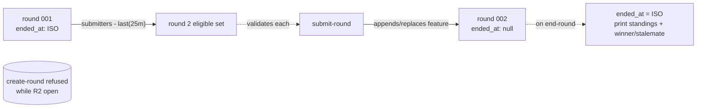

# feat: Américas TPG round CLI

## Summary

Three new CLI scripts (create-round, submit-round, end-round) sit alongside the existing CLI in `src/`, reusing the sampler / GADM / RNG / format primitives unchanged and persisting each round as one GeoJSON file under `rounds/`. Round identity, eligibility, and elimination are derived from those files at runtime — no separate state file — with a 25 m tie rule and an `ended_at` round-close marker as the only behavioral additions beyond the brainstorm's literal surface. This plan also lands the project's first test runner (`node:test`) so the rule logic is covered by AE-mapped tests.

***

## Problem Frame

The repo already samples a uniformly-distributed Americas land point and resolves it to a GADM admin region — that primitive answered "give me one target." This plan composes that primitive into the multi-round elimination-game runner described in the origin requirements doc, so the operator can drop the parallel-spreadsheet workaround for tracking who's still in, who came farthest, and who didn't show up. (See origin: `docs/brainstorms/2026-05-06-001-feat-americas-tpg-requirements.md`.)

***

## Requirements

All requirements trace to the origin doc. Numbering matches origin to keep traceability direct.

**Round file**

* R1. A round is persisted as exactly one GeoJSON file under `rounds/` containing the round target and (over time) the per-player submissions.

* R2. The round target is generated using the existing sampler / RNG / GADM lookup pipeline (uniform-on-Americas-band, mainland-US rejected, GADM-classified target).

* R3. create-round prints the target in the same human-readable single-line format the existing CLI emits.

* R4. create-round refuses to overwrite an existing round file; it must produce a new round, never mutate an existing one.

**Roster derivation**

* R5. Active roster is fully derivable from `rounds/` content. No separate state file, no roster property in round files, no external bookkeeping.

* R6. Round 1 is open enrollment: any player name accompanying a submission is considered eligible.

* R7. For round N ≥ 2, eligibility = the player submitted in round N-1 AND was not last-place in round N-1.

**Submissions**

* R8. update-submissions handles one player submission per invocation; the runner runs it again for each new submission.

* R9. If the player has not submitted yet this round, the submission is appended; if they have already submitted, theirs is replaced.

* R10. Each submission carries `player` (string), `distance` (number, km from target via `@turf/distance`), and — when GADM lookup resolves the coordinates — `location` (string) as GeoJSON feature properties. When GADM returns both `name_1` and `name_0`, `location` is `name_1, name_0` (this includes mainland-US submissions, which yield e.g. `California, United States`). When GADM returns only `name_0` (no admin level 1), `location` is `name_0` alone. When no GADM polygon resolves (ocean only), `location` is omitted.

* R11. update-submissions rejects submissions that violate eligibility (R6, R7) or arrive after end-round has run for that round, with a clear error.

**Elimination**

* R12. end-round computes eliminations from the current round file plus, for round N ≥ 2, the prior round file: last-place is always eliminated; in round N ≥ 2, players who did not submit are also eliminated.

* R13. The player with the largest `distance` is always eliminated. Any other player whose `distance` is not at least 25 m (0.025 km) smaller than that largest distance is considered tied for last and is also eliminated.

* R14. end-round prints, for the round just ended: each submitter's distance to the target, the eliminated set, and either a winner declaration (when exactly one player would remain eligible going forward) or a stalemate notice (when zero would remain).

**Plan-derived behavior**

* R15. create-round refuses to start a new round while any prior round file has `ended_at: null`. Rationale: prevents ambiguous active-round state that would corrupt submit-round and end-round target resolution.

* R16. end-round is idempotent. Re-running on an already-ended round prints the same standings, eliminations, and winner/stalemate banner without mutating `properties.ended_at`. Rationale: lets the operator reproduce a prior round's output without touching the audit trail.

**Origin actors:** A1 (Game Runner), A2 (Player)
**Origin flows:** F1 (Round creation), F2 (Submission collection), F3 (Round end and elimination)
**Origin acceptance examples:** AE1, AE2, AE3, AE4, AE5, AE6, AE7, AE8 — each enumerated as a test scenario in the relevant unit below.

***

## Scope Boundaries

Inherited from origin:

* Photo handling of any kind in code (photos out-of-band only).

* Player authentication, identity verification, anti-cheat, location-spoofing detection.

* Any player ↔ runner communication channel (Slack / Discord / email / web / push).

* Web server, mobile app, GUI, or any non-CLI interface.

* Round timers, submission deadlines, scheduled cutoffs in code.

* Cross-game leaderboards, all-time stats, or game history beyond the natural `rounds/` archive.

* Geofencing or biasing the sampler toward populated/accessible regions.

* A separate roster file or `state.json`. State is derived from `rounds/`.

* Multi-game concurrency in one repo. Starting over means archiving / clearing `rounds/`.

Plan-local exclusions:

* Refactoring `src/index.ts` or breaking changes to any existing primitive's interface. New scripts call them as-is, with one strictly-additive exception: U4 extends `src/gadm.ts`'s `LookupResult` so the `mainland-us` variant carries the underlying GADM feature (R10 needs the names for US submissions). Adds a property to one variant of a discriminated union without changing existing-caller behavior.

* A unified `yarn americas-tpg` umbrella — three explicit per-command scripts instead.

* Persisting per-game stats / winner-history files beyond `rounds/`.

### Deferred to Follow-Up Work

* Retrofitting tests onto existing untested files (`src/sampler.ts`, `src/gadm.ts`, `src/rng.ts`, `src/rng-random-org.ts`, `src/format.ts`). The `node:test` runner this plan adds makes them straightforward to cover later, but they're outside this PR.

* A `CLAUDE.md` update describing the three new commands. Worth doing once the commands land, not in the same change set.

***

## Context & Research

### Relevant Code and Patterns

* `src/index.ts` — existing CLI entry point. Uses `parseArgs` from `node:util` with `strict: true`; new scripts mirror this arg-parsing pattern exactly.

* `src/sampler.ts` — `samplePosition(rng)` returns a `Position` inside the Americas band. create-round reuses it without modification.

* `src/gadm.ts` — `openGadm(path?)` returns a handle with `lookup(position)` returning `'ocean' | 'mainland-us' | 'accept'`. create-round reuses for target classification; submit-round reuses for the optional `location` property on each submission.

* `src/rng.ts` — `createRng(name)` and the `rngFactories` map. create-round mirrors the existing `--rng` flag; defaults to `crypto`.

* `src/format.ts` — `formatHuman` produces the single-line `lat°N/S lon°E/W, level1, country` shape. create-round emits the target through this exact path so target output is byte-identical to the existing CLI's per-point output.

* `tsconfig.json` — `erasableSyntaxOnly: true`. New files avoid `enum`, `namespace`, parameter-property class shorthand, and any other emit-bearing syntax. ESM imports use `.ts` extensions.

* `biome.json` — single quotes, 2-space indent, LF. Pre-commit hook (`.husky/pre-commit` → `yarn lint-staged`) auto-formats on commit, so style violations land formatted regardless.

* `package.json` — Yarn 4 PnP, `"type": "module"`, `engines.node >=24`. New scripts run via `yarn node`, not bare `node`.

* `data/gadm.gpkg` — required at runtime, gitignored, location overridable via `GADM_PATH`. create-round and submit-round both depend on it.

### Institutional Learnings

* `docs/solutions/` does not yet exist in this repo; no prior learnings to cite.

### External References

* `@turf/distance` (npm) — sibling of `@turf/boolean-point-in-polygon` already in the dep tree. Default unit `kilometers`; accepts `Position` arrays `[lon, lat]` directly. No external research needed beyond the package README at implementation time.

***

## Key Technical Decisions

* **Round file naming:** **`rounds/<NNN>.geojson`** (zero-padded 3-digit sequential, mirroring `docs/plans/` numbering). Round number derives from filename; not duplicated as a property. Resolves origin Q1.

* **Round-end marker:** **`properties.ended_at`** at the GeoJSON top level — `null` while open, ISO 8601 once ended. Single source of truth for "is this round still accepting submissions." Submissions reject when set; create-round refuses to start a new round while any prior round is unended (see R15).

* **Target / submission discrimination via** **`id: "target"`** on the first feature. Both target and submissions carry a synthesized `location` property in the same `[name_1, ] name_0` shape; the discriminator is `id`, not the property set. Remaining features are submissions (no `id`, with `player` + `distance` + optional `location`). Avoids a nested `kind` enum or splitting target into top-level non-feature properties; keeps the file a valid `FeatureCollection` with internally consistent feature shapes.

* **submit-round arg shape: positional** **`<player> <lat> <lng>`**, with optional `--round N` for explicit targeting. Active round defaults to "the highest-numbered round file whose `ended_at` is null." Resolves origin Q2. Positional matches the natural typing rhythm of "alice 12.345 -67.890".

* **end-round idempotent re-end (see R16).** Re-running on an already-ended round prints the same standings, eliminations, and winner/stalemate banner without mutating `ended_at`. Lets the operator reproduce output without touching the audit trail. `--round N` available to target a specific round explicitly.

* **end-round stdout shape.** Standings sorted ascending by distance, one line per submitter (`<player>  <km>`); eliminations grouped by reason (last / 25 m-tied / DNS); trailing winner-or-stalemate banner when applicable. Resolves origin Q3.

* **Distance dependency:** **`@turf/distance`.** Pinned at `yarn add` time; matches the origin doc's framing and keeps the `@turf/*` family consistent.

* **Test runner: Node 24's built-in** **`node:test`.** Zero new dependencies; tests live adjacent to source as `*.test.ts`; invoked via `yarn node --test 'src/**/*.test.ts'` exposed as `yarn test`. Aligns with the project's "native Node, no transpile" ethos. The earlier `feat-random-americas-cli-plan` deferred a test runner; this plan unblocks it on the smallest possible footprint.

* **Atomic writes via tmp + rename.** Every round-file mutation writes to a sibling `*.tmp` then `fs.rename`s into place, so a crashed write leaves the prior file untouched.

* **No retrofit tests.** The five existing untested files (`sampler.ts`, `gadm.ts`, `rng.ts`, `rng-random-org.ts`, `format.ts`) stay untested in this PR — see Deferred to Follow-Up Work.

***

## Open Questions

### Resolved During Planning

* **Round file naming + round-number representation (origin Q1)** — `rounds/<NNN>.geojson`, zero-padded 3 digits. Round number from filename only.

* **submit-round arg shape (origin Q2)** — positional `<player> <lat> <lng>`, `--round N` override, active round defaults to highest unended file.

* **end-round stdout format (origin Q3)** — sorted standings + grouped eliminations + winner/stalemate banner.

* **RNG flow into create-round (origin Q4)** — mirror existing `--rng` flag; default `crypto`; no per-game RNG state.

* **Test runner choice** — `node:test` (built-in), invoked via `yarn test`.

### Deferred to Implementation

* **Exact** **`@turf/distance`** **import shape** — confirmed at implementation time by reading the package's published types. The function accepts `Position` arrays and a `{ units }` option; the implementer wires it directly.

* **Whether** **`yarn create-round`,** **`yarn submit-round`,** **`yarn end-round`** **should print a usage line on** **`--help`** — yes by convention; exact text is implementer's call.

***

## High-Level Technical Design

> *This illustrates the intended approach and is directional guidance for review, not implementation specification. The implementing agent should treat it as context, not code to reproduce.*

A round file is a GeoJSON `FeatureCollection` with two top-level extension properties (`round`, `ended_at`) and an ordered features array where the first feature is the target:

```jsonc
{
  "type": "FeatureCollection",
  "properties": {
    "round": 3,
    "ended_at": null
  },
  "features": [
    {
      "type": "Feature",
      "id": "target",
      "geometry": { "type": "Point", "coordinates": [-67.123456, -42.987654] },
      "properties": {
        "location": "Río Negro, Argentina"
      }
    },
    {
      "type": "Feature",
      "geometry": { "type": "Point", "coordinates": [-67.5, -43.0] },
      "properties": {
        "player": "alice",
        "distance": 71.234,
        "location": "Río Negro, Argentina"
      }
    }
  ]
}
```

Once `end-round` runs, `properties.ended_at` flips from `null` to an ISO 8601 timestamp; eliminations are not persisted — they are derivable on demand from the submissions plus R12/R13.

Roster flow across rounds (state derived only from on-disk round files):



***

## Implementation Units

* U1. **Test runner, distance dependency, gitignore**

**Goal:** Wire up `node:test` as the project's test runner and add `@turf/distance` as a runtime dependency.

**Requirements:** R10 (distance dep), enables tests for R1–R14

**Dependencies:** None

**Files:**

* Modify: `package.json` (add `@turf/distance`; add scripts `test`, `create-round`, `submit-round`, `end-round`)

**Approach:**

* `yarn add @turf/distance` for the runtime dep.

* New `yarn test` script: `yarn node --test 'src/**/*.test.ts'`. Node 24's type-stripping handles `.ts` test files without configuration.

* New per-command scripts mirror `yarn start`'s shape: `yarn node src/<entrypoint>.ts`.

* `rounds/` is committed to the repo (not gitignored). Round files are part of the audit trail.

**Patterns to follow:**

* Existing `package.json` script style (commands shelled to `yarn node ...`).

* Existing `.gitignore` formatting.

**Test scenarios:**

* Test expectation: none — config-only unit; the runner is exercised by U2 onward.

**Verification:**

* `yarn test` exits 0 with no test files yet (pre-U2) or with all U2+ tests passing (post-U2).

* `yarn create-round --help`, `yarn submit-round --help`, `yarn end-round --help` resolve to the right entry points (smoke; entry points may not yet exist when U1 lands solo).

***

* U2. **Round file domain: pure logic split from filesystem IO**

**Goal:** Define the round file shape and provide all the helpers the three command scripts need, split across two modules — pure domain logic in one, filesystem IO in the other — so the rule logic is testable without touching disk.

**Requirements:** R1, R5, R6, R7, R12, R13, R14, R15, R16

**Dependencies:** U1

**Files:**

* Create: `src/round-domain.ts` (types + pure computations)

* Create: `src/round-domain.test.ts`

* Create: `src/round-file.ts` (filesystem helpers)

* Create: `src/round-file.test.ts`

**Approach:**

* Types in `round-domain.ts`: `RoundFile` (extends `FeatureCollection` with `properties: { round: number, ended_at: string | null }`), `TargetFeature` (`Feature<Point>` with `id: 'target'` and `properties.location`), `SubmissionFeature` (`Feature<Point>` with `properties.player`, `properties.distance`, and optional `properties.location`).

* Pure derivations in `round-domain.ts` over a `RoundFile`: `submitters(round)`, `eliminationsForRound(round)` (returns the set of player names eliminated under R12/R13), `eligibleForNextRound(round)` (= `submitters - eliminationsForRound`), `validateSubmissionEligibility({ player, currentRound, prevRound })` returning `{ eligible: boolean, reason?: string }` — taking `RoundFile` objects, not directories.

* `formatStandings(round)` in `round-domain.ts`: returns the multi-line text block end-round prints (sorted-by-distance lines plus elimination groupings).

* `formatLocation({ name_0, name_1 })` in `round-domain.ts`: returns the `[name_1, ] name_0` location string per R10 (`name_1, name_0` when both, `name_0` alone when only country resolves, `null` when name\_0 is missing). Used by both create-round (target synthesis) and submit-round (submission decoration).

* `formatTargetLine(target)` in `round-domain.ts`: returns the single-line `<lat>°N/S <lon>°E/W, <location>` string create-round prints, mirroring `src/format.ts`'s `formatHuman` hemispheric-notation logic so output stays byte-identical to the existing CLI's per-point format.

* Filesystem helpers in `round-file.ts`: `roundPath(n, dir)`, `parseRoundNumber(filename)`, `listRoundFiles(dir)` (sorted ascending), `findActiveRound(dir)` (highest with `ended_at: null`), `findLatestRound(dir)` (highest regardless), `readRound(path)` (parses + validates), `writeRoundAtomic(path, data)` (tmp + rename).

* `readRound` validates structurally: top-level `properties.round` is a positive integer; `properties.ended_at` is `null` or an ISO-8601 string; `features[0].id === 'target'` AND `features[0].properties` has no `player` key (dual-invariant target discrimination); subsequent features carry `player`, `distance`, and optionally `location`. Any violation raises a structural error naming the offending field.

* IO uses `JSON.parse` / `JSON.stringify` only — no GeoJSON-aware library transforms — so the `id` discriminator survives round-trips intact.

**Patterns to follow:**

* `src/gadm.ts` style for type-safe wrapper around looser external types.

* `src/format.ts` style for pure presentation functions.

* `node:fs/promises` for all IO, including directory listing. Avoid `node:fs` synchronous variants throughout.

**Test scenarios:**

* *Happy path:* `roundPath(3) === 'rounds/003.geojson'`; `parseRoundNumber('rounds/003.geojson') === 3`.

* *Happy path:* `listRoundFiles` returns rounds sorted ascending by number for an arbitrary set of files.

* *Happy path:* `readRound` parses a well-formed round file into the typed shape (target as first feature with `id: 'target'`, no `player` in target properties, `ended_at` present).

* *Happy path:* `writeRoundAtomic` produces the file at the target path; the tmp sibling does not linger after success.

* *Edge case:* empty rounds dir → `listRoundFiles` returns `[]`; `findActiveRound` returns `null`.

* *Edge case:* only ended rounds → `findActiveRound` returns `null`; `findLatestRound` returns the highest.

* *Edge case:* `eliminationsForRound` returns just the farthest player when no others are within 25 m. **Covers R12.**

* *Edge case:* `eliminationsForRound` returns all players within 25 m of the farthest distance. **Covers AE4 / R13.**

* *Edge case:* `eliminationsForRound` on a round with zero submissions returns an empty set.

* *Edge case:* `eligibleForNextRound` after a 3-submitter round 1 = submitters minus the farthest. **Covers AE1 setup.**

* *Edge case:* `validateSubmissionEligibility` returns `eligible: true` for any name when `prevRound` is `null` (round 1). **Covers R6.**

* *Edge case:* `validateSubmissionEligibility` returns `eligible: false` for a player not in `eligibleForNextRound(prevRound)`. **Covers R7 / AE3.**

* *Error path:* `readRound` rejects malformed JSON, missing target feature, target not at index 0, `id` missing on `features[0]`, missing `properties.round`, or wrong types — clear error message naming the offending field.

* *Happy path:* `formatStandings` output for a 3-player round shows lines sorted ascending by distance with km formatting.

**Verification:**

* All round-file IO and rule logic is reachable through these two modules; U3/U4/U5 do not duplicate any of it.

* Pure-logic tests in `round-domain.test.ts` import only `round-domain.ts` and exercise no filesystem code.

* The 25 m tie rule is implemented exactly once (in `round-domain.ts`), not in end-round directly.

***

* U3. **create-round command**

**Goal:** CLI entry point that samples a target, writes a fresh round file, and prints the human-readable target line.

**Requirements:** R1, R2, R3, R4

**Dependencies:** U1, U2

**Files:**

* Create: `src/create-round.ts`

* Test: `src/create-round.test.ts`

**Approach:**

* Mirror `src/index.ts`'s `parseArgs` shape: `--rng`, `--help`, plus an optional `--rounds-dir` for tests (default `rounds`).

* Resolve next round number: highest existing file + 1; if no rounds, 1.

* Refuse if any prior round file has `ended_at: null` (concurrency guard, see Key Technical Decisions).

* Sample target via existing pipeline: `samplePosition(rng)` + `gadm.lookup`; loop on `ocean` / `mainland-us` per the existing convention.

* Build target `Feature` with `id: 'target'` and `properties.location` synthesized from the GADM lookup result via `formatLocation` (R10 shape). Since create-round only accepts non-mainland-US polygons, location is always non-null.

* Write `rounds/<N>.geojson` atomically with `properties: { round: N, ended_at: null }` and `features: [targetFeature]`.

* Print the target via `formatTargetLine(target)` from `round-domain.ts` — output is byte-identical to the existing CLI's per-point format because the helper reuses the same hemispheric-notation logic as `formatHuman`.

* Refuse if the target file already exists at the resolved path. **Covers AE8.**

**Patterns to follow:**

* `src/index.ts` for argument parsing, error printing, and exit codes.

* `src/sampler.ts` + `src/gadm.ts` reuse exactly as in `src/index.ts`.

**Test scenarios:**

* *Happy path:* empty rounds dir → creates `rounds/001.geojson` with target as first feature, `ended_at: null`, `round: 1`.

* *Happy path:* `rounds/001.geojson` exists and is ended → creates `rounds/002.geojson`.

* *Edge case:* `rounds/001.geojson` exists and is unended → refuses with a clear "prior round still active" error.

* *Edge case:* a target file already exists at the resolved path → refuses to overwrite. **Covers AE8 / R4.**

* *Happy path:* target feature has GADM properties matching the lookup result; geometry coordinates are in `[lon, lat]` order.

* *Happy path:* stdout matches `src/format.ts`'s `formatHuman` output for the same target (parity check via the formatter).

* *Integration:* end-to-end with a stub `RandomSource` returning fixed `(u_lat, u_lon)` pairs so the sampled position is deterministic. Verifies the loop terminates on a known-land position and writes the correct GADM-classified output.

* *Error path:* `--rng bogus` → fails per existing CLI's error path (delegated to `parseRng`).

**Verification:**

* `yarn create-round` from a clean rounds dir produces `rounds/001.geojson` and the same single-line target description the existing CLI emits.

* Re-running `yarn create-round` while round 1 is unended exits non-zero with the active-round error.

***

* U4. **submit-round command**

**Goal:** CLI entry point that adds or replaces a player's submission in the active round file, with eligibility, distance, and optional GADM `location` decoration.

**Requirements:** R6, R7, R8, R9, R10, R11

**Dependencies:** U1, U2, U3 (so a round file exists to test against)

**Files:**

* Create: `src/submit-round.ts`

* Test: `src/submit-round.test.ts`

* Modify: `src/gadm.ts` (extend the `mainland-us` `LookupResult` variant to carry the underlying GADM feature, mirroring the `accept` variant — strictly additive, no breaking change to existing callers)

**Approach:**

* Args: positional `<player> <lat> <lng>`; optional `--round N`, `--rounds-dir`.

* Normalize `<player>` by trimming surrounding whitespace before storage and comparison, so `alice` and `alice ` collapse to the same name.

* Resolve target round: explicit `--round`, else `findActiveRound`. Reject if no active round (no rounds at all, or latest is ended).

* Eligibility: load the current round file and the prior round file (when round N ≥ 2), then call `validateSubmissionEligibility({ player, currentRound, prevRound })` from `round-domain.ts`. On `eligible: false`, reject with an error message that includes the eligible-player set for the round (e.g., `player 'alice' not eligible for round 2. Eligible: bob, carol`) so typos and case mismatches are diagnosable from the error alone.

* Compute `distance` via `@turf/distance(targetCoords, submitCoords, { units: 'kilometers' })`.

* Compute `location` via `formatLocation` from the GADM lookup result. The lookup returns the underlying feature for both `accept` and `mainland-us` variants (the additive extension above), so US submissions yield e.g. `California, United States`. `ocean` returns `null` and `location` is omitted from the submission feature.

* Build `SubmissionFeature` and either append (player not yet submitted) or replace (player already in features) — match by trimmed `properties.player` exact-string.

* Atomic write via the round-file helper.

* Print a one-line confirmation showing the player + distance + location-or-blank.

**Patterns to follow:**

* `src/index.ts` for arg parsing.

* `src/gadm.ts`'s `openGadm` / `lookup` API; close the handle in a `finally`.

**Test scenarios:**

* *Happy path round 1 (open enrollment):* any player accepted, submission appended. **Covers R6 / AE1 setup.**

* *Round 2 ineligible (didn't submit prior):* rejected with a clear error.

* *Round 2 ineligible (was last in prior round):* `dan` who was last in round 1 is rejected when submitting in round 2. **Covers AE3 / R11.**

* *Replace, not append:* alice submits twice for the same round; second invocation replaces, total submission count for alice stays 1. **Covers AE7 / R9.**

* *Decoration:* `player`, `distance`, and `location` properties present when in a GADM polygon; `distance` matches `@turf/distance` for the input coords.

* *Decoration edge:* submission outside any GADM polygon (ocean, eastern Atlantic) → `location` property omitted, `player` and `distance` still present. **Covers R10.**

* *Error path:* round is ended (`ended_at` set) → rejected with a clear error. **Covers R11.**

* *Error path:* no active round at all → rejected with a clear error.

* *Error path:* invalid lat (out of `[-90, 90]`) or lng (out of `[-180, 180]`) → clear error.

* *Atomicity:* simulated mid-write failure leaves the prior round file's contents intact (verified by reading after the failure).

* *Integration:* round 1 → end-round → round 2 with one of the round-1 submitters re-submitting succeeds; round-1 last-place re-submitting in round 2 fails.

**Verification:**

* The `validateSubmissionEligibility` helper in U2 is the only place the eligibility rule is implemented; submit-round delegates rather than duplicating the check.

* `submit-round alice 12.345 -67.890` against the active round mutates the file once (atomic single rename) and prints the confirmation.

***

* U5. **end-round command**

**Goal:** CLI entry point that closes the active round, prints standings + eliminations + winner/stalemate, and stamps `ended_at`.

**Requirements:** R12, R13, R14

**Dependencies:** U1, U2, U4 (so submissions exist in round files for tests)

**Files:**

* Create: `src/end-round.ts`

* Test: `src/end-round.test.ts`

**Approach:**

* Args: optional `--round N`, `--rounds-dir`.

* Resolve target round: `findActiveRound` by default; `--round N` for explicit. Reject with a clear error if neither resolves to a real round.

* Compute eliminations: `eliminationsForRound` from `round-domain.ts` for last-place + 25 m-tied; for round N ≥ 2, additionally compute DNS = `eligibleForNextRound(prev) - submitters(current)`.

* Compute next-round eligible set: `submitters(current) - eliminationsForRound(current)`. Stalemate when this set is empty; winner declaration when size 1.

* Build the print output via `formatStandings` for the standings block, then append the elimination groupings (last / 25 m-tied / DNS) and the winner-or-stalemate banner.

* If the target round has `ended_at: null`: stamp `properties.ended_at = new Date().toISOString()` and atomic-write before printing. If the round is already ended (per R16): skip the write entirely and print as normal — same output, audit trail untouched.

**Patterns to follow:**

* U2's `formatStandings` for the standings block; do not reimplement formatting in this file.

* `src/format.ts` style for pure presentation functions.

**Test scenarios:**

* *Happy path AE1:* round 1 with 3 submitters (alice, bob, carol), no DNS. End-round eliminates only the farthest; standings printed sorted ascending. Round 2 eligibility = the two non-last players. **Covers AE1.**

* *Happy path AE2:* round 1 ended with alice/bob/carol surviving (dan eliminated). Round 2: alice and bob submit, carol does not. End-round eliminates farther of alice/bob plus carol (DNS); standings show alice + bob only. **Covers AE2 / R12.**

* *Edge case AE4:* two largest distances are 100.000 km and 100.020 km (within 25 m). Both eliminated as tied. **Covers AE4 / R13.**

* *Happy path AE5:* end-round runs and exactly one player would remain eligible going forward → winner declaration alongside standings. **Covers AE5 / R14.**

* *Edge case AE6 (everyone tied):* all current-round submitters are within 25 m of each other → all eliminated → stalemate banner. **Covers AE6 / R14.**

* *Edge case AE6 (sole submitter is also last):* round N ≥ 2 with one submitter (everyone else DNS) → that one submitter is "farthest" by trivial-tautology and is eliminated → stalemate banner. **Covers AE6.**

* *Idempotency:* end-round on an already-ended round → prints the same standings, eliminations, and banner; `ended_at` is unchanged. **Covers R16.**

* *Persistence:* `ended_at` is set to a parseable ISO 8601 string after the first run on an unended round.

* *Integration:* end-to-end create-round → submit-round (×N) → end-round produces the expected file state and stdout for AE1 and AE5 scenarios.

**Verification:**

* All elimination logic flows through U2's pure helpers; this file's responsibility is sequencing + I/O + presentation.

* Standings + eliminations + banner are visible in stdout; `ended_at` is visible in the round file.

***

## System-Wide Impact

* **Interaction graph:** Three new entry points are added; existing `src/index.ts` is not modified. The new CLIs depend on `src/sampler.ts`, `src/gadm.ts`, `src/rng.ts`, and `src/format.ts` as black-box imports. No global state is introduced.

* **Error propagation:** Each command exits non-zero on rejection (active-round violation, eligibility failure, ended-round, malformed file). Errors print to stderr; the operator can rerun after fixing input.

* **State lifecycle risks:** The `ended_at` flag is the single coordination point between submit-round (must be `null`) and create-round (any open round blocks). Atomic rename + per-command non-idempotency guard against partial-write or double-finalize.

* **API surface parity:** `--rng <crypto|math|random.org>` works the same way in create-round as in `src/index.ts`. The single-line target output of create-round is byte-identical to `formatHuman` output of `src/index.ts` for the same target, by reusing the same formatter.

* **Integration coverage:** End-to-end tests in U5 exercise create-round → submit-round (multiple) → end-round in a temp directory; this proves the cross-unit contracts that pure unit tests don't cover.

* **Unchanged invariants:** `src/index.ts`, `src/sampler.ts`, `src/gadm.ts`, `src/rng.ts`, `src/rng-random-org.ts`, `src/format.ts` are not edited. Their public exports are imported as-is. No type or behavior changes propagate back into the existing CLI.

***

## Risks & Dependencies

| Risk                                                                                               | Mitigation                                                                                                                                                                                       |
| :------------------------------------------------------------------------------------------------- | :----------------------------------------------------------------------------------------------------------------------------------------------------------------------------------------------- |
| GADM classifies a submit-round position as ocean or mainland-us                                    | `location` property is simply omitted; submission still recorded with `player` + `distance`. R10 explicitly allows.                                                                              |
| GADM classifies a create-round target as ocean or mainland-us                                      | The sampler resamples (existing behavior in `src/index.ts`); operator sees no error.                                                                                                             |
| GADM file unreadable / `openGadm` throws                                                           | Both create-round and submit-round fail loudly; operator must fix `GADM_PATH` or restore `data/gadm.gpkg` before retrying.                                                                       |
| Player name collision (operator types `Alice` then `alice`)                                        | Strict exact-string match on `properties.player`; differs as different players. Operator-side hygiene, not code's job.                                                                           |
| `@turf/distance`'s units default changes in a future major                                         | Pin a known-good version at install; existing `@turf/boolean-point-in-polygon` is `^7.3.5` so align similarly.                                                                                   |
| Round file becomes corrupt (manual edit, partial write before atomic rename was implemented, etc.) | `readRound` validates structure and rejects with a clear error; the round can be recreated by deleting the corrupt file before `create-round` (only viable when no submissions are recoverable). |
| Test runner discovers no `.test.ts` files and exits 0 silently                                     | `yarn test` glob is explicit (`'src/**/*.test.ts'`); from U2 onward, every feature-bearing unit lands tests in the same commit set.                                                              |

***

## Sources & References

* **Origin document:** `docs/brainstorms/2026-05-06-001-feat-americas-tpg-requirements.md`

* Related code: `src/index.ts`, `src/sampler.ts`, `src/gadm.ts`, `src/rng.ts`, `src/format.ts`

* Prior plan: `docs/plans/2026-05-06-002-feat-random-americas-cli-plan.md` (existing CLI architecture this plan extends)

* Project tooling: `CLAUDE.md`, `package.json`, `tsconfig.json`, `biome.json`

* External: [`@turf/distance`](https://www.npmjs.com/package/@turf/distance), [Node.js](https://nodejs.org/api/test.html) [`node:test`](https://nodejs.org/api/test.html)
