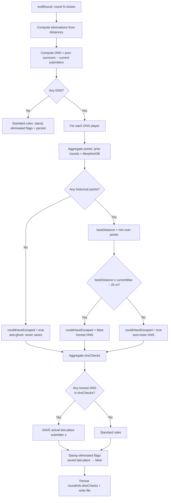

# feat: Save honest-DNS players from sore-loser elimination

## Summary

Layer a new "honest-DNS save" rule on top of `endRound`: when a did-not-submit player's best historical guess (from this game's prior rounds plus the MorphiorDB API) would still have placed them in the elimination zone, the actual last-place submitter(s) are spared instead. The rule's per-player findings persist on the round file as `roundInfo.dnsChecks`, keeping re-end deterministic without re-querying MorphiorDB.

---

## Problem Frame

The current TPG round-close rule eliminates both the actual farthest submitter (within the 25 m tie buffer) and any prior-round survivor who didn't submit this round (DNS). That lets a "sore loser" who senses they'd lose drop out and drag the actual worst submitter down with them. The new rule asks whether a DNS player ever had a realistic chance — judged from their submission history — and only counts the actual last-place elimination if the answer is "yes." When the answer is "no," the failure-to-submit is treated as honest defeat and the round's elimination slot is "absorbed" by the DNS, so the actual last-place submitter advances.

---

## Requirements

- R1. Apply the save rule only to DNS players; never replace an actual submission with a hypothetical point.
- R2. Determine "could have stayed in the game" using two combined sources of historical submissions: this game's prior round files and the MorphiorDB API.
- R3. Resolve a player name to a Discord ID via `GET /players?q={name}` on `https://tpg.marsmathis.com/api`, then fetch their submissions via `GET /submissions/{discord_id}`.
- R4. When the rule fires, the end-round output names the saved actual-last-place submitter(s).
- R5. For each DNS player whose check did not trigger a save, the end-round output prints an example point they could have submitted.
- R6. Re-running `endRound` on an already-ended round is deterministic — no MorphiorDB call, no behavior change.
- R7. MorphiorDB unavailability does not block end-round; the rule degrades to local-only history with a stderr warning.

---

## Scope Boundaries

- Caching MorphiorDB responses across rounds (each end-round queries fresh in v1).
- Retroactively re-running the rule on rounds already ended in `rounds/`.
- Manual operator override / opt-out flags (no `--no-morphiordb` or similar).
- Stalemate-specific logic — the rule applies normally; if a save would fire in pure stalemate, the result is "everyone advances" by direct application of the rule.
- Fetching or rendering actual photo images — MorphiorDB submissions are coordinates; the "example point" output is a coord plus GADM-resolved region label.

---

## Context & Research

### Relevant Code and Patterns

- `src/rng-random-org.ts` — established HTTP-fetch pattern: explicit timeout via `AbortSignal.timeout`, separate error messages for transport / status / parse failures, response-text snippet (`.slice(0, 200)`) included in messages. Mirror this for `morphiordb.ts`.
- `src/round-file.ts` — `listRoundFiles`, `readRound`, `writeRoundAtomic`, `validateRoundFile`. The validator already enforces the per-submission `eliminated` invariant (presence-iff-ended); the new `roundInfo.dnsChecks` foreign member follows the same shape.
- `src/round-domain.ts` — `eliminationsForRound`, `submissionsOf`, `submitters`, `endedAtOf`, `validateSubmissionEligibility`, the `TIE_BUFFER_KM` constant. The pure rule evaluator (U3) lives here alongside these.
- `src/end-round.ts` — current DNS computation reads `eliminated === false` from prev's submissions. The save-rule wiring extends the same branch.
- `@turf/distance` — already used by `submit-round`; the rule evaluator imports it the same way (PnP-compatible).

### Institutional Learnings

`docs/solutions/` does not exist in this repo — no prior learnings to surface.

### External References

- MorphiorDB OpenAPI spec at `https://tpg.marsmathis.com/api/openapi.json` (response shapes are documented as empty `{}` — actual shapes were confirmed by live probing during planning).
- MorphiorDB `/players?q=` endpoint behavior: case-insensitive substring match against name / canonical_name / aliases, returns array (possibly empty, possibly multi-result). Player object: `{ discord_id, canonical_name, name, aliases[] }`.
- MorphiorDB `/submissions/{discord_id}` endpoint behavior: returns `{ discord_id, lat, lon, count, occurrences[] }[]`. Empty array (HTTP 200) for unknown Discord IDs.

---

## Key Technical Decisions

- **"Could not have escaped" cutoff:** the player's best historical distance is `>= currentMax − TIE_BUFFER_KM`, mirroring the existing strict `<` boundary used by `eliminationsForRound`. Strict `<` is what the existing rule uses to decide tie-buffer membership; the new rule asks whether the same predicate would have held with the player hypothetically inserted.
- **MorphiorDB player-name resolution:** require an exact case-insensitive match against the player's `canonical_name`, `name`, or one of `aliases[]`. Zero or multiple exact matches → fall back to local-only history for that player. The fuzzy `?q=` search is a starting point, not the final answer — the strict match avoids accidentally pulling another player's history.
- **Empty-history DNS player:** a DNS player with zero historical submissions across both sources is treated as `couldHaveEscaped: true` and never triggers a save. This prevents new players from gaming the rule by ducking rounds before establishing history.
- **Save logic is binary across multiple DNS:** any single honest-DNS player (`couldHaveEscaped: false`) triggers the save of all actual last-place submitter(s) in the round. Multiple honest-DNS doesn't compound — only one save event happens per round.
- **MorphiorDB graceful degradation:** the per-DNS check carries one of four `morphiorDbStatus` values: `ok` (one exact-match player resolved AND submissions fetched without error), `notFound` (zero exact-match players for the queried name), `ambiguous` (multiple exact-match players), `unavailable` (any HTTP error — timeout, non-2xx, parse failure). On `unavailable` the round closes using local-only history; `endRound` never throws because of MorphiorDB unreachability. A `morphiorDbSubmissionCount: number | null` field accompanies the status so an `ok` outcome with zero submissions is distinguishable from an `ok` outcome with populated submissions. The validator (U6) enforces both fields.
- **Persistence shape:** new `roundInfo.dnsChecks` foreign member, an array of per-DNS-player records. Always present on ended rounds (validator enforces); always absent on in-progress rounds (validator enforces). Mirrors the existing per-submission `eliminated` invariant.
- **Re-end determinism:** when `endRound` runs against a round whose `endedAt` is non-null, it reads `dnsChecks` from disk and re-renders output without any MorphiorDB call. The `eliminated` flags on submissions are already correct on disk.
- **Output transparency:** for each DNS check, the output prints the player's best historical example (coord + GADM-resolved region + distance). When the save fires, an additional line names the saved player(s) and which DNS check triggered the save. Operator can see what each DNS player would have done either way.

---

## Open Questions

### Resolved During Planning

- **Is `dnsChecks` required or optional on ended rounds?** Required. Mirrors the `eliminated` flag invariant. We have no legacy ended-round files to migrate.
- **Where does the rule evaluator live?** `src/round-domain.ts`, as a pure function. No I/O. Easy to unit-test.
- **Does the rule mutate the persisted `eliminated` flag?** Yes — the flag is the source of truth for "is this submitter eliminated this round?" The rule decides who that is before the flag is stamped.
- **What does "could possibly have sent a submission which would leave them in the game" mean operationally?** The min over the player's historical submission distances to the current target is `<` (currentMax − TIE_BUFFER_KM). Anti-ghost: empty history evaluates as "could have escaped" (i.e., never saves).

### Deferred to Implementation

- Exact wording of the saved-line and example-photo lines in `formatRoundOutput`. Implementation should pick wording consistent with the existing eliminated/dnsSet sections.
- Whether `morphiorDbStatus` carries additional sub-statuses distinguishing 5xx from 4xx. Keep the v1 enum compact: `ok | notFound | ambiguous | unavailable`.

---

## High-Level Technical Design

> *This illustrates the rule's flow at end-round close and is directional guidance for review, not implementation specification. The implementing agent should treat it as context, not code to reproduce.*

The same `endRound` function path covers both first-run (full rule evaluation, MorphiorDB fetch) and re-end (read persisted `dnsChecks`, no fetch). The split is governed by `endedAtOf(current) === null`.

---

## Implementation Units

- U1. **Add `morphiordb.ts` HTTP client module**

**Goal:** Provide a minimal, testable client for MorphiorDB's two endpoints, with the same error-handling shape as `rng-random-org.ts`.

**Requirements:** R3, R7

**Dependencies:** none

**Files:**
- Create: `src/morphiordb.ts`
- Create: `tests/morphiordb.test.ts`

**Approach:**
- Export a `MorphiorClient` type and an `openMorphiorClient` factory taking optional `baseUrl`, `timeoutMs`, and `fetchImpl` (the last for test injection; default uses global `fetch`).
- The client exposes two operations: looking up a player by name (returns the single matching player record or null) and fetching a player's submissions (returns the list of submitted points).
- Player resolution logic: hit `/players?q={name}`, then filter the response down to records whose `canonical_name`, `name`, or any alias exact-match the query string case-insensitively. Return the single match if exactly one survives the filter; otherwise null.
- Submission fetch: hit `/submissions/{discord_id}`, return the array of `{lat, lon}` points (drop the rest of the row — count / occurrences are unused by this rule).
- Errors throw a typed `MorphiorDbError` carrying a `kind: 'timeout' | 'status' | 'parse' | 'transport'` discriminant so the caller in U4 can downgrade to `morphiorDbStatus: 'unavailable'` without inspecting message text.

**Patterns to follow:**
- `src/rng-random-org.ts` — timeout via `AbortSignal.timeout`, structured error messages, response-text snippet truncation, validation of parsed values.

**Test scenarios:**
- Happy path: name lookup returns a single player → returned as-is. Submissions for known Discord ID → array of point coords.
- Edge case: empty `?q=` result → name lookup returns null.
- Edge case: multi-result `?q=`, none exactly matching name/canonical_name/aliases → name lookup returns null.
- Edge case: substring match with no exact match (e.g. `?q=anz` returning `Anza`) → name lookup returns null (strict).
- Edge case: case-insensitive exact alias match (`anza` ↔ `Anza`) → name lookup returns the player.
- Edge case: empty submissions array (unknown Discord ID, HTTP 200) → submissions fetch returns `[]`.
- Error path: HTTP 500 → `MorphiorDbError({kind: 'status'})`.
- Error path: timeout → `MorphiorDbError({kind: 'timeout'})`.
- Error path: malformed JSON → `MorphiorDbError({kind: 'parse'})`.
- Error path: network failure → `MorphiorDbError({kind: 'transport'})`.

**Verification:** the tests pass; the client is consumable by U4 with `fetchImpl` injection.

---

- U2. **Add prior-round submission aggregator**

**Goal:** Walk the rounds directory and gather every point a named player has submitted across earlier ended rounds.

**Requirements:** R2

**Dependencies:** none structurally (no preceding plan units), but reuses `listRoundFiles` / `readRound` from `src/round-file.ts` and `submissionsOf` / `endedAtOf` from `src/round-domain.ts`.

**Files:**
- Modify: `src/round-file.ts` — add a `listSubmissionsForPlayer` helper (player name + rounds dir + optional `excludeRound`).
- Modify: `tests/round-file.test.ts` — add coverage.

**Approach:**
- Reuse `listRoundFiles` to enumerate, then `readRound` for each file. Skip the round at `excludeRound` (typically the round currently closing).
- Only ended rounds count as history (in-progress rounds are filtered out). Iterate `submissionsOf(round)` and collect `{lon, lat}` for every submission whose `properties.player` byte-equals the queried player.
- Player-name comparison is byte-exact, post-NFC, matching the identity model used by `normalizePlayerName` and the rest of the codebase.

**Patterns to follow:**
- Existing `listRoundFiles` / `readRound` pair.
- Submission iteration as in `simplestyle.ts` and `end-round.ts`.

**Test scenarios:**
- Happy path: player submitted in rounds 1 and 2 → result is two points in declaration order.
- Edge case: empty rounds directory → `[]`.
- Edge case: player has no historical submissions → `[]`.
- Edge case: `excludeRound` filters out the named round even when the player has a submission there.
- Edge case: in-progress round is excluded from history aggregation (only ended rounds count).
- Edge case: duplicate submissions (same coord across rounds) appear twice — caller dedupes if desired; min-distance is unaffected.

**Verification:** unit tests pass; the helper is callable from U4 and does not import MorphiorDB.

---

- U3. **Add the pure rule evaluator in `round-domain.ts`**

**Goal:** Encapsulate the "would this DNS player have been eliminated" math as a pure function, independent of I/O.

**Requirements:** R1, R2

**Dependencies:** none

**Files:**
- Modify: `src/round-domain.ts` — add the `evaluateDnsCheck` function plus the `DnsCheck` type that downstream code persists.
- Modify: `tests/round-domain.test.ts` — add coverage.

**Approach:**
- Inputs: the round's target position, a list of historical points for one DNS player, the current round's max submission distance in km. Output: an object recording the best point, the best distance (or null when no points), and a boolean for whether the player could have escaped elimination.
- Empty points → `{bestPoint: null, bestDistanceKm: null, couldHaveEscaped: true}` (anti-ghost).
- Non-empty points → compute distance from each to target via `@turf/distance` in km (matching existing usage); `bestDistanceKm` is the min, `bestPoint` is the corresponding point.
- `couldHaveEscaped = bestDistanceKm < currentMaxKm − TIE_BUFFER_KM`. The strict `<` mirrors `eliminationsForRound`'s `max − distance < TIE_BUFFER_KM` so the boundary semantics align exactly.

**Patterns to follow:**
- `eliminationsForRound` for the boundary math (`TIE_BUFFER_KM` is already exported).

**Test scenarios:**
- Edge case: empty points → `{bestPoint: null, bestDistanceKm: null, couldHaveEscaped: true}`.
- Happy path: best point is far from target (bestDistance >> currentMax) → `couldHaveEscaped: false`.
- Edge case: bestDistance exactly at `currentMax − TIE_BUFFER_KM` (boundary) → `couldHaveEscaped: false` (strict `<` matches `eliminationsForRound`).
- Edge case: bestDistance just under the boundary (`currentMax − TIE_BUFFER_KM − ε`) → `couldHaveEscaped: true`.
- Edge case: bestDistance very close to target (sub-meter) → `couldHaveEscaped: true`.
- Happy path: multiple points, only one safe → returns the safest as `bestPoint`.

**Verification:** unit tests pass; the evaluator is callable from U4 with synthetic inputs.

---

- U4. **Wire the rule into `end-round.ts`**

**Goal:** Compose U1, U2, and U3 inside `endRound` so closing a round evaluates each DNS player's check, decides whether to save the actual last-place submitter(s), and persists the per-DNS findings on the round file.

**Requirements:** R1, R2, R3, R6, R7

**Dependencies:** U1, U2, U3

**Files:**
- Modify: `src/end-round.ts`
- Modify: `src/round-domain.ts` — add an `applyDnsSaveRule` helper that takes the eliminations set and the dnsChecks list and returns the set of players to save (the eliminations set when any honest DNS exists; empty otherwise); also add an `eliminationsFromFlags(round)` helper that returns the set of submitters whose persisted `eliminated === true` (used by the re-end branch instead of the distance-based recompute).
- Modify: `tests/end-round.test.ts` — add coverage.

**Approach:**
- Inject MorphiorDB client via a dependency parameter on `EndRoundDeps` (default created from `openMorphiorClient()`); tests pass a stub client.
- First-run branch (`endedAtOf(current) === null`):
  1. Existing path computes `eliminations` from distances and `dnsSet` from prev's `eliminated` flags.
  2. For each DNS player: gather historical points from the U2 helper plus, best-effort, MorphiorDB (U1). Record `morphiorDbStatus` per the resolution outcome.
  3. Run U3's evaluator per player to build `dnsChecks: DnsCheck[]`.
  4. Call `applyDnsSaveRule` to compute the saved set. If any honest DNS exists, the saved set is the current `eliminations` set; otherwise empty.
  5. Stamp `eliminated` on submissions: `false` when the player is in the saved set, otherwise driven by `eliminations`.
  6. Write the round atomically with `roundInfo.dnsChecks` alongside `endedAt`.
- Re-end branch (`endedAtOf(current) !== null`): the on-disk `eliminated` flags and `roundInfo.dnsChecks` are already authoritative. Derive eliminations from submissions whose `eliminated === true` via a new `eliminationsFromFlags` helper in `round-domain.ts` — parallel to `eliminationsForRound`, which still owns the first-run path. Compute the saved-set as the players in `eliminationsForRound(current)` (distance-derived) minus the players in `eliminationsFromFlags(current)` (persisted) — i.e., the submitters the rule spared. Read `roundInfo.dnsChecks` from disk and call `formatRoundOutput` with the persisted `dnsChecks` and the saved-set so the output reflects post-rule state. Do not call MorphiorDB; do not write the file.
- MorphiorDB error handling: a `MorphiorDbError` from U1 is caught at the wire-in site, logged once to stderr, and downgraded to `morphiorDbStatus: 'unavailable'` for that player. Other DNS players in the same round still get evaluated.

**Execution note:** Sequence the implementation to land U1–U3 (with their tests) before U4 so the integration unit can stub the client interface and reuse the pure evaluator.

**Patterns to follow:**
- Existing first-run vs. re-end split in `endRound`.
- The submissions-reconstruction pattern that uses `targetOf`/`submissionsOf` (post-recent-refactor).

**Test scenarios:**
- Happy path: one DNS, honest → save fires; actual last-place's `eliminated: false`; `dnsChecks` persisted with `couldHaveEscaped: false`.
- Happy path: one DNS, sore loser → no save; last-place's `eliminated: true`; `dnsChecks` persisted with `couldHaveEscaped: true`.
- Edge case: multiple DNS, one honest + one sore loser → save fires once; both DNS recorded.
- Edge case: tie at last place — two submitters both within 25 m of `currentMax`, one honest DNS → both tied submitters' `eliminated: false` (the entire `eliminationsForRound` set is saved, not just the singular farthest).
- Edge case: multiple DNS, all sore losers → no save; all recorded as `couldHaveEscaped: true`.
- Edge case: zero DNS → `dnsChecks: []` persisted; behavior identical to pre-rule.
- Edge case: DNS with empty history (no prior in-game rounds; MorphiorDB returns `[]`) → `couldHaveEscaped: true`; no save; `morphiorDbStatus: 'ok'`.
- Edge case: DNS player resolves to no MorphiorDB match (zero exact matches) → `morphiorDbStatus: 'notFound'`; local-only history used.
- Edge case: DNS player resolves ambiguously in MorphiorDB → `morphiorDbStatus: 'ambiguous'`; local-only history used.
- Error path: MorphiorDB throws `MorphiorDbError` → degraded to local-only; `morphiorDbStatus: 'unavailable'`; round still closes; one stderr warning printed.
- Idempotency: re-end on a saved round → output identical, MorphiorDB stub call counter is zero on the second run, `eliminated` flags unchanged on disk.
- Integration: `createRound` (stub) → `submitRound` (stubbed location/distance) → `endRound` with a stubbed MorphiorDB client and pre-seeded prior-round files; the wired pipeline produces the expected save/no-save outcome end-to-end.

**Verification:** the tests pass; closing a round with a DNS player and a stubbed client produces the expected `dnsChecks` shape on disk and the expected output text.

---

- U5. **Update output formatting in `end-round.ts`**

**Goal:** Surface the rule's findings in `formatRoundOutput` — naming saved players when the rule fires and printing each DNS player's best example point.

**Requirements:** R4, R5

**Dependencies:** U4

**Files:**
- Modify: `src/end-round.ts` — extend `EndRoundDeps` with a `lookupLocation` dependency (the same `LookupLocation` shape and `makeGadmLookupLocation(openGadm())` default already used in `submit-round.ts`, with `gadm.close()` in a `finally`); extend `formatRoundOutput` and its `FormatInput` type to accept the lookup and the new sections; import `openGadm` and `makeGadmLookupLocation` from their existing locations.
- Modify: `tests/end-round.test.ts` — add coverage of the new sections (tests inject a stub `lookupLocation` to avoid GADM I/O).

**Approach:**
- Carry `dnsChecks` and the saved-set through to `formatRoundOutput`.
- After the existing Eliminated section, render two new optional sections:
  - **Saved** section (only when the saved set is non-empty) — names each saved player and at least one honest-DNS check that triggered the save.
  - **DNS could-have-sent** section (only when `dnsChecks` is non-empty) — for each DNS check, render the player name, their best example point as `lat°N/S lon°E/W`, the GADM-resolved region label (looked up via the GADM handle plumbed through `EndRoundDeps`, in the same shape that `submit-round` uses), and the distance from target.
- DNS players with no history print "no submission history available" instead of a coord.
- Reuse the existing `formatHuman`-style point rendering from `src/format.ts` so the example line matches the look of the sampler's output.

**Patterns to follow:**
- Existing sections in `formatRoundOutput`.
- `src/format.ts:formatHuman` for the coord+region line shape.

**Test scenarios:**
- Save fires: output contains a "Saved" section naming the saved player and citing the triggering DNS check.
- Save doesn't fire, one DNS: output contains the DNS-example line with coord + region + distance.
- Save fires AND there are also sore-loser DNS: both new sections present, each populated.
- DNS player with no history: line reads "no submission history available" (or equivalent) and carries no coord.
- Zero DNS: neither new section appears — output unchanged from pre-rule shape.
- Idempotent re-end: identical output text on the second run.

**Verification:** the tests pass; rendered output is human-readable and matches the tone of the existing eliminated/dnsSet sections.

---

- U6. **Validator and CLAUDE.md updates**

**Goal:** Lock the persistence invariant for `roundInfo.dnsChecks` and document the rule.

**Requirements:** R6

**Dependencies:** U4

**Files:**
- Modify: `src/round-domain.ts` — extend the `RoundInfo` interface with `dnsChecks?: DnsCheck[]` so TypeScript permits the foreign-member assignment in U4. The runtime validator enforces presence-iff-ended; the TS type stays optional so both states compile.
- Modify: `src/round-file.ts` — extend `validateRoundFile` to enforce `roundInfo.dnsChecks`.
- Modify: `tests/round-file.test.ts` — add invariant tests.
- Modify: `CLAUDE.md` — document the rule under the existing "Round file format (load-bearing)" section.

**Approach:**
- Validator enforces:
  - In-progress rounds (`endedAt === null`): `roundInfo.dnsChecks` MUST NOT be present.
  - Ended rounds (`endedAt !== null`): `roundInfo.dnsChecks` MUST be present and MUST be an array. Each item MUST be an object with required fields: `player` (non-empty string), `couldHaveEscaped` (boolean), `bestDistanceKm` (finite number or null), `bestPoint` (`[lon, lat]` array of finite numbers or null), `morphiorDbStatus` (one of `ok` / `notFound` / `ambiguous` / `unavailable`), `morphiorDbSubmissionCount` (non-negative integer when `morphiorDbStatus === 'ok'`; null otherwise — disambiguates "ok with N submissions" from "ok with zero submissions"). The `bestPoint`/`bestDistanceKm` pair must agree (both null or both populated).
- CLAUDE.md gains a new "load-bearing" subsection mirroring the existing `eliminated` invariant subsection: presence-iff-ended, the rule the field encodes, and the re-end determinism guarantee. Reference the new behavior from the `end-round` flow description.

**Test scenarios:**
- Validator rejects an in-progress round carrying `dnsChecks`.
- Validator rejects an ended round missing `dnsChecks`.
- Validator rejects an ended round whose `dnsChecks` item is missing a required field.
- Validator rejects an ended round whose `dnsChecks` item has the wrong type for a field (e.g., `couldHaveEscaped: 'false'`).
- Validator rejects an ended round whose `dnsChecks` item carries `morphiorDbStatus: 'ok'` with `morphiorDbSubmissionCount: null`, or any non-`'ok'` status with a non-null count.
- Validator rejects an ended round with mismatched `bestPoint`/`bestDistanceKm` (one null, one populated).
- Validator accepts an ended round with empty `dnsChecks` (zero-DNS round).
- Validator accepts an ended round with multiple `dnsChecks` items.

**Verification:** the tests pass; CLAUDE.md update reads cleanly alongside the existing `eliminated` invariant section.

---

## System-Wide Impact

- **Interaction graph:** `endRound` gains an HTTP dependency. The rule evaluator (U3) is pure; I/O lives in `morphiordb.ts` (HTTP) and `round-file.ts` (filesystem). No callbacks, middleware, or observers in this codebase.
- **Error propagation:** MorphiorDB errors are caught and downgraded inside `endRound`; never block round-close. Filesystem and validator errors propagate as today.
- **State lifecycle risks:** re-end determinism depends on `dnsChecks` being persisted accurately. The atomic-write pattern in `writeRoundAtomic` already prevents partial-write hazards.
- **API surface parity:** none — single CLI surface, single operator.
- **Integration coverage:** the end-to-end `endRound` test (U4 integration scenario) is the only place callbacks-style integration matters: MorphiorDB stub + filesystem + the rule + the formatter all in one path.
- **Unchanged invariants:** the existing `eliminated` presence-iff-ended invariant, the `endedAt` and `language` foreign-member shapes, and the `--force` ordering invariant in `validateSubmissionEligibility` — none change.

---

## Risks & Dependencies

| Risk | Mitigation |
|------|------------|
| MorphiorDB API shape changes (response fields renamed, semantics shifted) | The `morphiordb.ts` client validates response shape; on parse failure the per-DNS check records `morphiorDbStatus: 'unavailable'` and falls back to local-only. CI relies on stubbed responses; any opt-in live smoke test stays env-gated. |
| MorphiorDB latency stalls end-round | 15-second per-request timeout via `AbortSignal.timeout` (mirrors `rng-random-org.ts`). Worst case for N DNS players: ~30 s wall-clock per player (one player query + one submissions query). Fast enough for an interactive operator. |
| MorphiorDB returns the wrong player due to fuzzy `?q=` match | Strict exact-match filter on `canonical_name`/`name`/`aliases` after the API call. Ambiguous → fall back to local-only. |
| Anti-ghost rule's "empty history" guard incorrectly fails to save when MorphiorDB is unavailable AND the player has no in-game prior rounds | Conservative behavior is intentional: with no points anywhere, `couldHaveEscaped: true`, no save. If we cannot justify the save, we don't. |
| Schema migration for old ended rounds | None on disk currently — the only ended rounds are those we'll write under the new rule. The validator rejects any future hand-edited file missing `dnsChecks`. |

---

## Documentation / Operational Notes

- CLAUDE.md gains the "Honest-DNS save rule" load-bearing subsection (handled in U6).
- The README's "End round" section may benefit from a one-paragraph mention; not blocking — defer to a future doc commit.
- Operators running tests offline can disable MorphiorDB for a single end-round by injecting a stub via the existing `EndRoundDeps` seam; no CLI flag needed.

---

## Deferred / Open Questions

### From 2026-05-09 review

- **Anti-ghost rule treats new + serial-DNS players as sore losers** — Key Technical Decisions / Empty-history DNS player (P1, product-lens + adversarial, confidence 100)

  A long-tenured player with a string of legitimate DNS rounds (offline, illness, time zone) accumulates zero historical submissions and is treated identically to a brand-new account ducking rounds. Both get `couldHaveEscaped: true` and never trigger a save, contradicting the Problem Frame's stated intent — counting honest defeat, not genuine absence. Either augment dnsCheck records with a "rounds-eligible-but-DNS" count to distinguish a brand-new account from a long-DNS pattern, or keep the strict rule and document the fairness cost explicitly. A user call.

  <!-- dedup-key: section="key technical decisions empty history dns player" title="anti ghost rule treats new and serial dns players as sore losers" evidence="a dns player with zero historical submissions across both sources is treated as couldhaveescaped true and never triggers a save this prevents new players from gaming" -->

- **Identity shift to intent-inference unacknowledged** — Problem Frame / Key Technical Decisions (P1, product-lens, confidence 75)

  The plan reframes elimination from a pure "farthest distance" rule to "elimination depends on plausibility of intent." Players will see "saved by honest-DNS" lines in end-round output and the operator will need to explain a richer judgment model than the original game contract. The plan does not say whether this shift is owned (called out and embraced), hidden (operator-only), or finessed in player-facing wording. Add a one-paragraph framing decision to the plan body before implementation.

  <!-- dedup-key: section="problem frame key technical decisions" title="identity shift to intent inference unacknowledged" evidence="the new rule asks whether a dns player ever had a realistic chance judged from their submission history and only counts the actual last-place" -->

### From 2026-05-09 code review

- **MorphiorDB outage during round-close locks an unfair "denied save" via re-end determinism** — `src/end-round.ts` rule pipeline (P2, adversarial, confidence 100)

  For a new-this-game player whose only history lives in MorphiorDB, a transport error during round-close → `mdbPoints = []`, local history empty → anti-ghost guard fires → `couldHaveEscaped: true` → no save. Re-end is deterministic, so re-running `end-round` after MorphiorDB recovers won't reopen the decision; the dnsCheck is frozen on disk. Combines with the open anti-ghost cohort question above. Two structural paths to consider: (a) record `bestPoint: null` + `morphiorDbStatus: 'unavailable'` and treat that pair as "rule abstained, not honest-DNS" so the save decision falls back to standard rules rather than the anti-ghost branch; or (b) allow an explicit re-evaluation flag for ended rounds when MorphiorDB recovers. Both warrant their own design pass alongside the cohort-fairness deferral.

  <!-- dedup-key: section="src end round ts rule pipeline" title="morphiordb outage during round close locks unfair denied save via re end determinism" evidence="for a new this game player whose only history lives in morphiordb a transport error during round close yields no save and re end propagates the bad outcome" -->

---

## Sources & References

- MorphiorDB OpenAPI spec: `https://tpg.marsmathis.com/api/openapi.json`
- Existing HTTP-fetch pattern: `src/rng-random-org.ts`
- Existing rule pattern: `eliminationsForRound`, `validateSubmissionEligibility` in `src/round-domain.ts`
- Existing invariant pattern: `eliminated` flag (CLAUDE.md "eliminated flag invariant" subsection)
